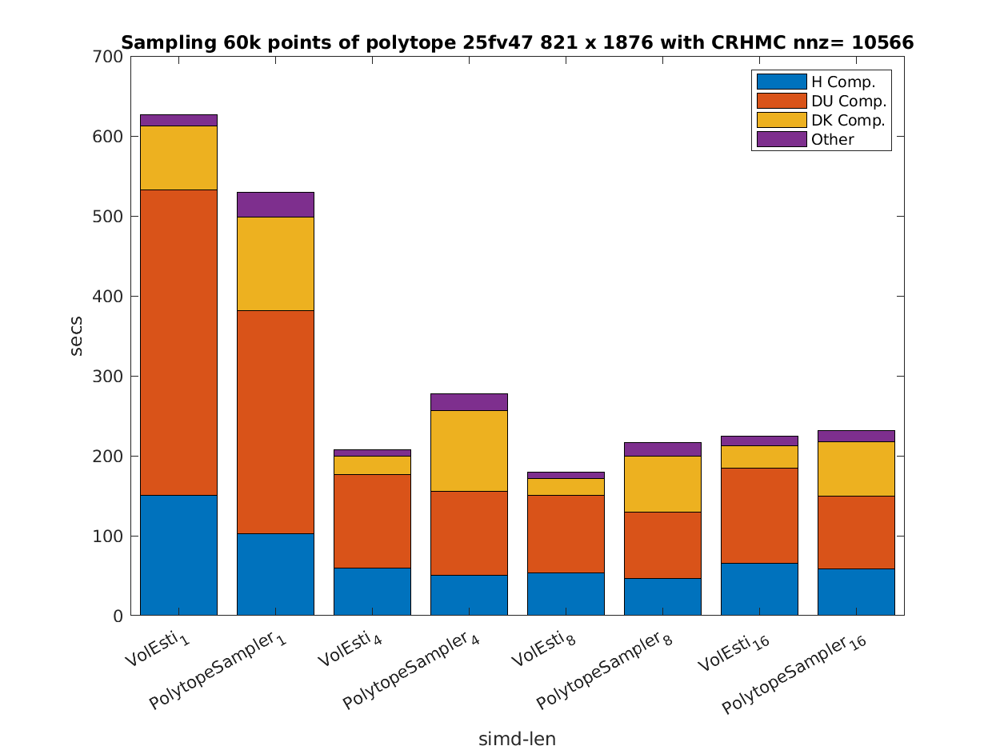
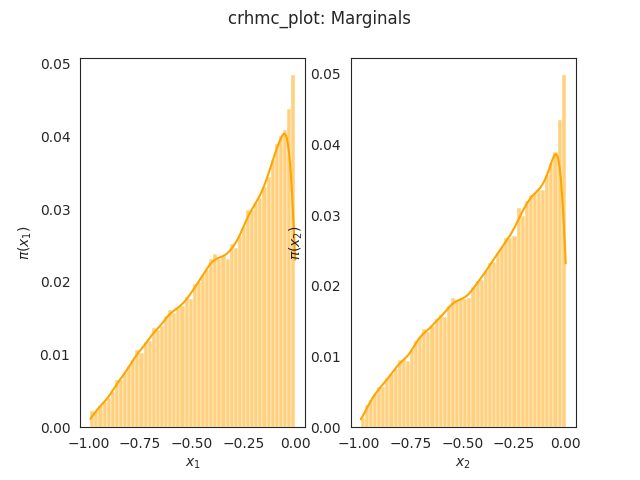
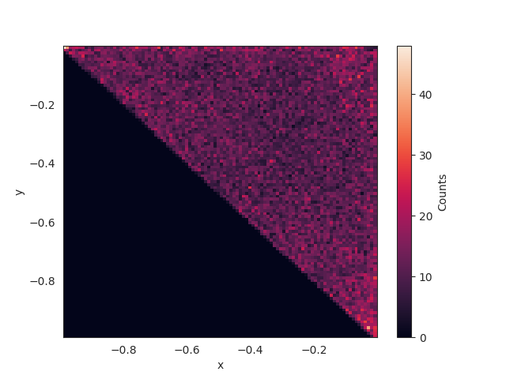
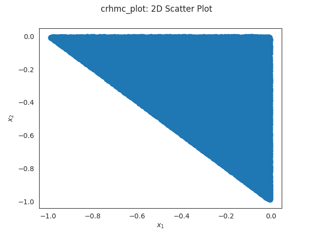

## Introduction
Through this work we present a C++ with R interface implementation of the [CRHMC](https://arxiv.org/abs/2202.01908) algorithm. This project was build through the Google Summer of Code program in [GeomScale](https://github.com/GeomScale/). Main goal for this problem was to implement the CRHMC in VolEsti with high performance. With this project now the VolEsti library has the capability to sample from large sparse polytopes. Previously all VolEsti random walks would process the constraint matrix in dense form. One can view the project Proposal [Here](https://summerofcode.withgoogle.com/proposals/details/sDta8y7e).

## Bonding Period
 In the bonding period we had a number of meetings that helped me understand the goals of the program and the CRHMC algorithm. In one of the meetings I was asked to present the overall algorithm ([Slides](https://drive.google.com/file/d/1XIsnjAG8iBzgtsPHOd2-kCVKCclNC6Pr/view?usp=sharing)).
## Code Included
 The code for this module is currently under review by the VolEsti team and it spans multiple pull requests.

 1. Polytope preparation process: [Pull Request](https://github.com/GeomScale/volesti/pull/238)  Status: **Merged**
 2. Initial implementation of the CRHMC walk: [Pull Request](https://github.com/GeomScale/volesti/pull/239) Status: **Under Review**
 3. Performance optimization of the implementation through the use of vectorized computation and R-interface: [Pull Request](https://github.com/GeomScale/volesti/pull/245) Status: **Under Review**

## Results and Testing
Our main concern of the project was the performance of the resulting computation. So we will present a number of experiments that show the speed of our implementation. Examples are run against the [PolytopeSampler](https://github.com/ConstrainedSampler/PolytopeSamplerMatlab) package.

As for testing the code we added a number of examples and post processing scripts in the VolEsti library. This way a user can easily run our code and process the output. Here are a couple of plots that demonstrate possible possible results and correctness.

